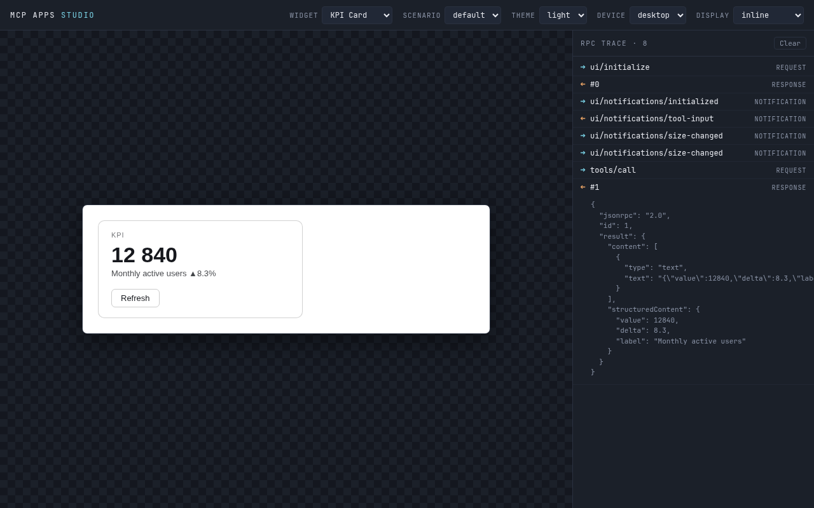
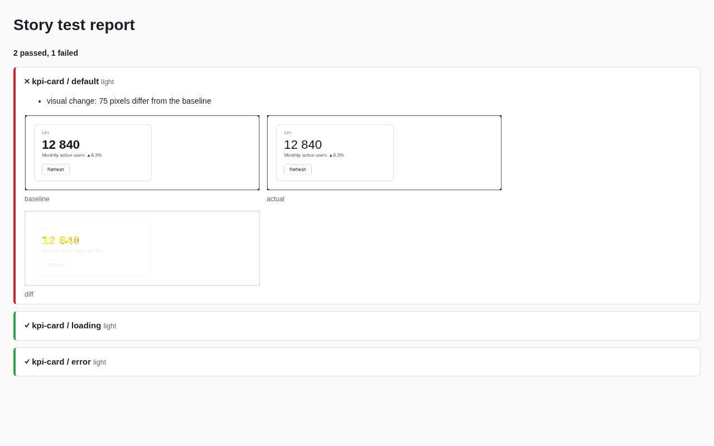

# MCP Apps Studio

**Storybook + Playwright for [MCP Apps](https://github.com/modelcontextprotocol/ext-apps) widgets.**

Develop widgets against stories and mocked tool calls, with no server, chat or LLM in the loop. Then run every story headlessly in CI. MCP Apps Studio stands in for the host (Claude, ChatGPT): it renders your widget in a sandboxed iframe and runs the JSON-RPC bridge, the theme and display-mode context and the tool calls. It also shows every message that crosses the iframe boundary.

Targets the MCP Apps extension (SEP-1865), spec version `2026-01-26`.

> **Status: 0.x, pre-release.** The API may still change between minor versions.



## Why

Without a local host, seeing any change to a widget means a full round trip: deploy the server, open the chat, invoke the tool, and hope the iframe loads. States like loading, a backend error, dark mode or picture-in-picture are hard to reproduce. The protocol between widget and host is invisible, so when something breaks you are guessing.

MCP Apps Studio replaces the host with one you control:

- **Scenarios instead of deploys.** Describe a widget and its states (`default`, `loading`, `error`, `empty`) in a story file, and switch between them in one click.
- **Mocks instead of backends.** Every `tools/call` is answered from the scenario: a static result, a tool error, a protocol error, a delay, or a pass-through to a real server.
- **A trace instead of guessing.** Every request, response and notification in both directions is logged, including malformed messages your widget shouldn't have sent.
- **Stories as a test suite.** `mcp-apps-studio test` plays every scenario in headless Chromium in CI. A run fails if the handshake doesn't complete, if an invalid message crosses the bridge, or if the pixels changed.
- **Fixtures from reality.** Record a session against your real server and save it as an offline scenario.
- **As strict as real hosts.** Widgets run in an iframe sandboxed with `allow-scripts` only, trust is based on the null origin, and every incoming message is validated. So if a widget works here, it hasn't quietly relied on `window.parent` or `allow-same-origin`.

## How it compares

| | MCP Apps Studio | [MCP Inspector](https://github.com/modelcontextprotocol/inspector) / [MCPJam](https://github.com/MCPJam/inspector) | Storybook |
|---|---|---|---|
| Focus | The **widget**: its states, protocol hygiene, regression tests | The **server**: tools, resources, OAuth, chatting with an LLM | UI components in general |
| Host emulation (sandbox, SEP-1865 bridge, host context) | ✅ | Partial / via a real chat | ❌ |
| Mocked tool calls per scenario | ✅ | ❌ | Via addons |
| Headless CI runs + visual diffs | ✅ `mcp-apps-studio test` | ❌ | Via test runner / Chromatic |

Use an inspector to poke your server. Use MCP Apps Studio to build and test what the server renders.

## Quickstart

In your MCP Apps project (Node 22+):

```bash
npm i -D mcp-apps-studio              # stories import its types, so install it locally
npx mcp-apps-studio init              # scaffold a *.stories.mcp.ts next to every widget HTML it finds
npx mcp-apps-studio                   # the studio over your stories → http://127.0.0.1:4400/?token=…
npx mcp-apps-studio install-browser   # once: Chromium matching the bundled Playwright
npx mcp-apps-studio test              # every story × theme in headless Chromium; exit 1 on failure
```

When you save a story or a widget, the open studio reloads it and keeps your scenario. A story that fails to load shows up in a banner and doesn't take the others down, though it still fails `test`. `npx mcp-apps-studio --help` lists every command, and `<command> --help` lists that command's flags.

## Stories

```ts
// src/widgets/kpi-card.stories.mcp.ts
import { defineWidgetStory } from 'mcp-apps-studio';

export default defineWidgetStory({
  title: 'KPI Card',
  widget: './kpi-card.html', // relative to this file, or a dev-server URL
  scenarios: {
    default: {
      // the model's call that rendered the widget: pushed as tool-input → tool-result after the handshake
      toolCall: {
        name: 'get_metrics',
        input: { period: '30d' },
        result: { kind: 'static', structuredContent: { value: 12840, delta: 8.3, label: 'MAU' } },
      },
      // the widget's own tools/call, answered as a CallToolResult
      // (`content` defaults to a JSON text block of structuredContent)
      mocks: { get_metrics: { kind: 'static', structuredContent: { value: 12840, delta: 8.3, label: 'MAU' } } },
    },
    loading: { mocks: { get_metrics: { kind: 'static', structuredContent: {}, delayMs: 3_600_000 } } },
    // a tool failure (isError result); use kind: 'rpc-error' for a JSON-RPC protocol error
    error: { mocks: { get_metrics: { kind: 'error', message: 'Metrics backend unavailable' } } },
    cancelled: { toolCall: { name: 'get_metrics', result: { kind: 'cancelled', reason: 'user' } } },
    // no mocks → calls go to the MCP server given by ?server= (default http://localhost:3100/mcp)
    live: { mocks: {} },
  },
});
```

Story files are validated when they are loaded. A misspelled mock kind fails with the file name and the exact path, such as `scenarios.default.mocks.get_metrics.kind`, instead of surfacing in the browser.

| Field | Meaning |
|---|---|
| `toolCall` | The model's call that rendered the widget: `{ name, input?, partialInputs?, result? }`. It is played after `ui/notifications/initialized` as `tool-input-partial`* → `tool-input` → `tool-result` or `tool-cancelled`. |
| `mocks` | Answers to the widget's own `tools/call`, keyed by tool name. |

| Mock `kind` | Fields | Answer |
|---|---|---|
| `static` | `structuredContent?`, `content?`, `delayMs?` | A `CallToolResult`. `content` defaults to a JSON text block of `structuredContent`. |
| `error` | `message`, `delayMs?` | A `CallToolResult` with `isError: true`, which is how servers report tool failures. |
| `rpc-error` | `error: { code, message }`, `delayMs?` | A JSON-RPC error (a protocol failure). Not allowed as a `toolCall.result`. |
| `passthrough` | — | Forwarded to the connected MCP server (same as having no mock in `live`). |
| `cancelled` | `reason?`, `delayMs?` | For `toolCall.result` only: sends `tool-cancelled`. |

**In the studio**, you can open a given state directly with a deep link: `?widget=kpi-card&scenario=error&theme=dark&display=fullscreen&device=mobile`. In the `live` scenario, **Save scenario** turns the real session into an offline `recorded-<n>` scenario and copies a story snippet you can paste.

## Test in CI

```bash
npx mcp-apps-studio test
#   ✓ kpi-card/default [light]
#   ✗ kpi-card/error [dark]
#       invalid message: Unsupported notification: wat
#   11 passed, 1 failed
```

Every widget × scenario (except `live`) × theme runs in headless Chromium. Each run must pass these checks:

- the studio rendered the requested widget, scenario and theme;
- the SDK handshake completed;
- the trace has no invalid messages.

Screenshots, `report.json` and a reviewable `report.html` land in `--out` (default `.mcp-studio/test`). The exit code is `1` on any failure, and `2` when Chromium is missing.

**Visual regression (opt-in).** `test --update-snapshots` writes baselines to `mcp-studio-snapshots/`, and only from runs that passed. Commit them. From then on, every run is diffed against its baseline (`--threshold 0.1` and `--max-diff-pixels 0` by default). A change fails the run, and `report.html` shows the baseline, the actual screenshot and the diff side by side. Fonts differ between operating systems, so generate baselines on the platform CI uses.



**GitHub Actions.** It takes one step. The report is attached as an artifact and summarized on the run page:

```yaml
- uses: actions/setup-node@v7
  with: { node-version: 22 }
- run: npm ci
- uses: yanic0de/mcp-apps-studio@v0   # MCP Apps Studio story tests
  with:
    directory: .                        # where your *.stories.mcp.ts live
    # version: 0.1.0                    # pin the CLI version (default: latest)
    # args: --themes light              # extra `test` flags
```

## Write widgets that work on real hosts

Widgets talk to the host through the official MCP Apps SDK, [`@modelcontextprotocol/ext-apps`](https://github.com/modelcontextprotocol/ext-apps). Its `App` class is the reference implementation of the widget side of SEP-1865, so a widget that works here works in any MCP Apps host.

[`@mcp-apps-studio/widget-runtime`](packages/widget-runtime) adds only what the SDK leaves to you:

- `connectWidget` records the originating tool call **before** the handshake. Hosts send `tool-result` right after the handshake, often before your UI mounts.
- It keeps the document in sync with the host theme, style variables and fonts.

```bash
npm i @mcp-apps-studio/widget-runtime @modelcontextprotocol/ext-apps @modelcontextprotocol/client zod
```

```ts
import { connectWidget, toolResultData } from '@mcp-apps-studio/widget-runtime';

const { app, lifecycle } = await connectWidget({ appInfo: { name: 'kpi-card', version: '1.0.0' } });
// app is the SDK App: ui/initialize → ui/notifications/initialized done, auto-resize on

lifecycle.subscribe(() => render(lifecycle.getSnapshot()));           // tool-input → tool-result | cancelled
const result = await app.callServerTool({ name: 'get_metrics', arguments: {} }); // CallToolResult
const metrics = toolResultData(result);                               // structuredContent, throws the isError text
```

React:

```tsx
import { WidgetProvider, useToolCall, useToolLifecycle, useWidgetApp } from '@mcp-apps-studio/widget-runtime/react';

createRoot(root).render(<WidgetProvider session={await connectWidget({ appInfo })}><KpiCard /></WidgetProvider>);

function KpiCard() {
  const { data, error, loading, call } = useToolCall<Metrics>('get_metrics'); // data = structuredContent
  useEffect(() => void call(), [call]);
}
```

**Library components** follow one contract:

- theming only through `--widget-*` CSS variables and `[data-theme='dark']`;
- a text-only fallback per component;
- stories for every state.

They are copied into your project rather than depended on, shadcn-style. `add` keeps files you already have unless you pass `--force`:

```bash
npx mcp-apps-studio add data-table --dir src/components
```

**Widgets from a Vite dev server, with hot module replacement.** Point a story at your dev server and add the plugin:

```ts
// vite.config.ts
import { mcpAppsStudio } from 'mcp-apps-studio/vite';
export default defineConfig({ plugins: [mcpAppsStudio()] });

// weather.stories.mcp.ts
export default defineWidgetStory({ title: 'Weather', widget: 'http://localhost:5173/', scenarios: { /* … */ } });
```

## Security notes

MCP Apps Studio runs code you did not necessarily write: widgets, and the stories that describe them. Here is what it does about that:

- **Widgets** run in an iframe sandboxed with `allow-scripts` only, never `allow-same-origin`. Messages are accepted only from that frame (`event.source`), and each one is validated before it is dispatched.
- **The local server** binds to `127.0.0.1` only. Every request needs the one-time token printed at start (compared in constant time, then kept in an `HttpOnly`, `SameSite=Strict` cookie).
- **Stories are code.** `mcp-apps-studio` and `test` execute them. Don't run the GitHub Action on untrusted fork PRs with secrets available (for example, under `pull_request_target`).
- **The Vite plugin is a trade-off.** It adds the `null` origin to your dev server's CORS allowlist. While the dev server runs, any sandboxed page open in your browser can read it, including your source and inlined `VITE_*` values. Keep secrets out of `VITE_*`, and stop the dev server before you browse untrusted sites.

Found a vulnerability? See [SECURITY.md](SECURITY.md). Please don't open a public issue.

## Troubleshooting

| Symptom | Fix |
|---|---|
| `test` exits `2`: "No Chromium for headless runs" | Run `npx mcp-apps-studio install-browser` (in CI on Linux, add `--with-deps`). Don't use a plain `npx playwright install`: it may fetch a different build. |
| `error: port 4400 is already in use` | Another studio is running. Pass `--port <n>`. |
| The studio opens with 401 | Open the exact URL printed at start, which carries the token. The token changes on every start. |
| A dev-server widget stays blank | Add the `mcpAppsStudio()` Vite plugin. Vite refuses module scripts to the sandbox's `null` origin. |
| Visual diffs fail in CI but pass locally | Fonts and antialiasing differ between operating systems. Generate baselines in CI or in a Linux container. |
| CSP checks behave differently in Firefox or Safari | CSP emulation uses the iframe `csp` attribute, which only Chromium supports. |

## Contributing

Bug reports, ideas and pull requests are welcome. Start with [CONTRIBUTING.md](CONTRIBUTING.md), which covers setup, commands and how changes are proposed. For how the pieces fit together, see [docs/ARCHITECTURE.md](docs/ARCHITECTURE.md). The full behavior is specified in [`openspec/specs/`](openspec/specs/), one spec per capability, with every scenario backed by a test.

## Roadmap

- [ ] `openai-apps` adapter for the OpenAI Apps SDK dialect
- [ ] Interaction steps in stories (click → expect a `tools/call` with given arguments)
- [ ] Accessibility checks in `test` (axe-core)
- [ ] Static export of the studio for PR previews
- [ ] Richer mocks: per-call sequences, argument matching, JSON fixtures

## License

[MIT](LICENSE)
